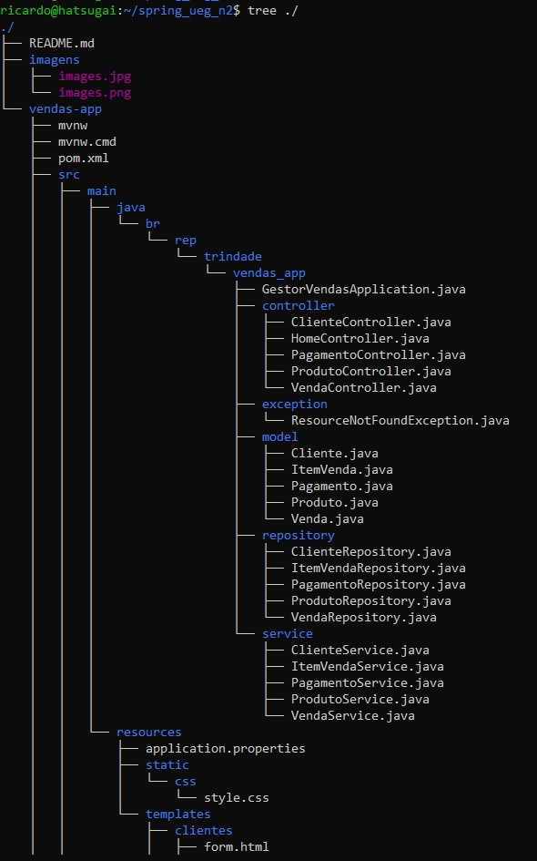
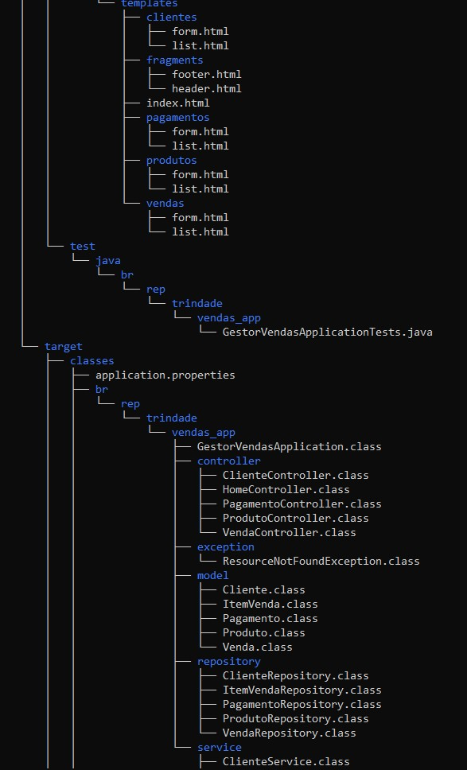
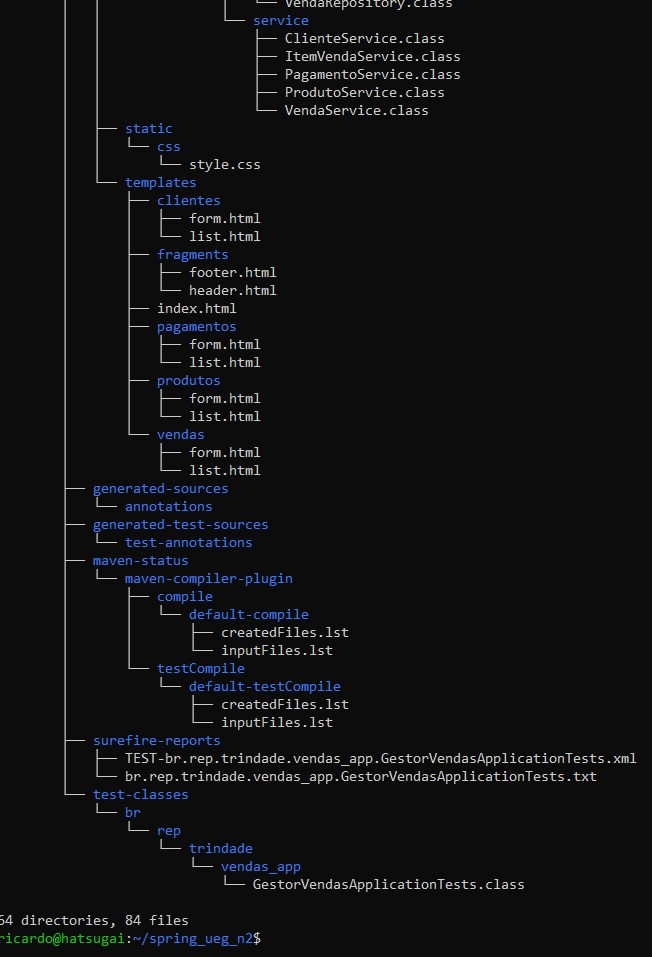

<h1 align="center">UEG - Campus Trindade      </h1> 
<h2>Configuração inicial do Projeto: <a href="https://start.spring.io/">https://start.spring.io/</a></h2>
<ul>
  <li>Detalhes do Spring Initializr:
    <ul>
      <li>Project: Maven Project.</li>
      <li>Language: Java.</li>
      <li>Spring Boot: 3.5.0 (ou mais recente que estiver trabalhando neste momento).</li>
      <li>Versão Java JDK: 21.</li>
      <li>Dependências:
        <ul>
          <li>Spring Web</li>
          <li>Spring Data JPA</li>
          <li>MySQL Driver</li>
          <li>Thymeleaf</li>
          <li>Lombok</li>
          <li>Spring Boot DevTools</li>
          <li>Validation</li>
        </ul>
      </li>
      <li>Ide: IntelliJ Community edition</li>
    </ul>
  </li>
</ul>
 
<h2 align="center">Trabalho de N2 de Programação Web</h2>
<h2 align="center"><strong>Estrutura de diretórios</strong></h2>

